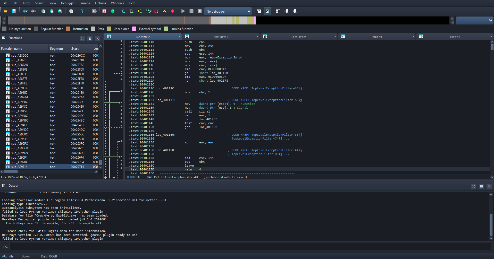
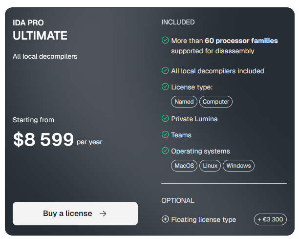

# IDA Pro Themes

Dark themes for [IDA Pro 9.x](https://hex-rays.com/pricing), inspired by Atom One Dark.



> IDA Pro costs $8'599 per year. These themes are free tho.



## Themes

| Theme          | Description                             |
| -------------- | --------------------------------------- |
| `one-dark`     | Atom One Dark palette                   |
| `one-dark-pro` | One Dark with contrast tweaks           |
| `darcula`      | JetBrains-style dark                    |
| `dark`         | Minimal dark                            |
| `67dark`       | Darker variant with custom accent color |
| `default`      | Adjusted IDA default                    |

## Setup

1. **Copy Stylesheet**: Copy `base/custom-base-theme.css` to your IDA themes directory.

```
C:\Program Files\IDA Pro 9.x\themes\
```

2. **Copy Folder**: Copy the theme folder of your choice into the same directory.

```
C:\Program Files\IDA Pro 9.x\themes\one-dark\
```

3. **Apply Theme**: Go to `Options -> Colors`, select the theme, click `OK`, and restart.

## Customization

Some themes include a `.reg` file to set a matching Windows title bar color.

| Theme      | File                                   |
| ---------- | -------------------------------------- |
| `one-dark` | `themes/one-dark/accent_onedark.reg`   |
| `67dark`   | `themes/67dark/accent_black_color.reg` |

Double-click the file and confirm. Modifies `HKCU\SOFTWARE\Microsoft\Windows\DWM`.

## License

[WTFPL](./LICENSE)
