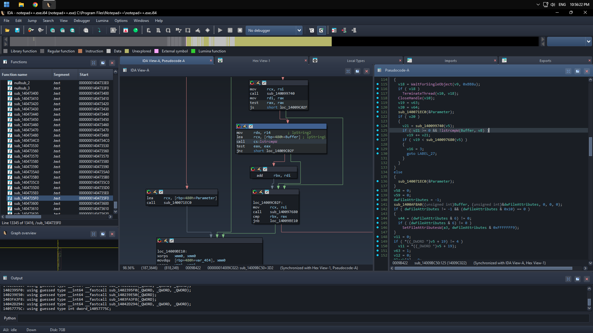

# IDA Pro Theme : 52-Dark

> This is modified from dp701 theme by AI and tuning a little bit by Me :)

## Installation

> Make it more cooler by apply `accent_black_color.reg` to make windows title black color.

- Copy `_base` and `52dark` in themes to your `$IDA_DIR/themes`
- Start IDA go to `Options > Colors...` and select current theme to `52dark`
